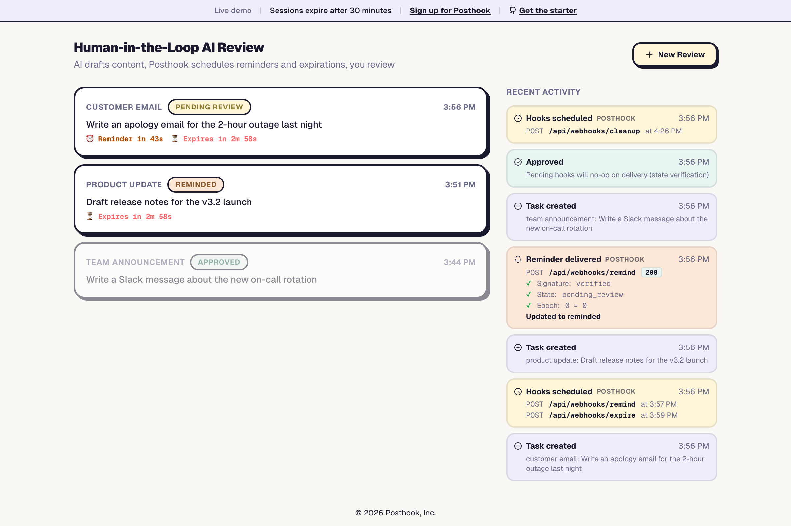

# Posthook Next.js Starter

Schedule delayed tasks in your Next.js app without cron, queues, or workflow engines. This starter uses [Posthook](https://posthook.io) for durable per-event scheduling.

The included example is a human-in-the-loop content review app with reminders, expirations, and snooze.

**See it running**: [nextjs-starter.posthook.io](https://nextjs-starter.posthook.io) ([demo source](https://github.com/posthook/nextjs-starter-live))

[](https://nextjs-starter.posthook.io)

## Setup

```bash
git clone https://github.com/posthook/nextjs-starter.git
cd nextjs-starter
npm install
docker compose up -d db
cp .env.example .env.local    # add your Posthook API key + signing key
npm run db:push
npm run dev
```

In another terminal, forward Posthook deliveries to your local server:

```bash
npx posthook listen --forward http://localhost:3000
```

## Try It

```bash
# Create a task (schedules reminder + expiration via Posthook)
curl -X POST http://localhost:3000/api/tasks \
  -H 'Content-Type: application/json' \
  -d '{"prompt":"Launch announcement","contentType":"blog post","draft":"We are launching today."}'

# List tasks
curl http://localhost:3000/api/tasks

# Approve a task (hooks will no-op when they fire)
curl -X PATCH http://localhost:3000/api/tasks/<id> \
  -H 'Content-Type: application/json' \
  -d '{"action":"approve"}'

# Snooze a task (schedules new reminder, old one self-disarms)
curl -X PATCH http://localhost:3000/api/tasks/<id> \
  -H 'Content-Type: application/json' \
  -d '{"action":"snooze","delay":"1h"}'
```

## Posthook Patterns

See [PATTERNS.md](PATTERNS.md) for detailed explanations and copy-pasteable code.

- **Schedule hooks before committing state** — if scheduling fails, no broken task
- **State verification on delivery** — every callback checks task state before acting
- **Epoch-based snooze** — old reminders self-disarm via epoch mismatch
- **Conditional database updates** — prevents race conditions
- **Parallel hook scheduling** — reminder + expiration via `Promise.all`
- **Per-route webhook handlers** — one route per hook type

## How to Add a New Hook Type

1. Add a payload type in `lib/types.ts`:
   ```typescript
   export type EscalatePayload = { taskId: string; level: number };
   ```

2. Create a webhook route at `app/api/webhooks/escalate/route.ts`:
   ```typescript
   export const runtime = "nodejs";
   export async function POST(request: Request) {
     const body = await request.text();
     const delivery = posthook().signatures.parseDelivery<EscalatePayload>(body, request.headers);
     // Check state, act or no-op
   }
   ```

3. Schedule the hook in `lib/tasks.ts`:
   ```typescript
   await posthook().hooks.schedule<EscalatePayload>({
     path: "/api/webhooks/escalate",
     postIn: "4h",
     data: { taskId: id, level: 1 },
   });
   ```

## Project Structure

```
app/api/
  tasks/route.ts            # POST (create), GET (list)
  tasks/[id]/route.ts       # GET (detail), PATCH (approve/reject/snooze)
  webhooks/
    remind/route.ts         # Posthook reminder callback
    expire/route.ts         # Posthook expiration callback
lib/
  posthook.ts               # Posthook client (lazy singleton)
  tasks.ts                  # Task state machine + Posthook scheduling
  store.ts                  # Data access layer (Drizzle)
  types.ts                  # TypeScript types + payload types
  db/schema.ts              # Drizzle schema
  db/index.ts               # Database connection
```

## Environment Variables

| Variable | Required | Description |
|---|---|---|
| `DATABASE_URL` | Yes | Postgres connection string |
| `POSTHOOK_API_KEY` | Yes | Posthook API key (`phk_...`) |
| `POSTHOOK_SIGNING_KEY` | Yes | Posthook signing key (`phs_...`) |
| `REMINDER_DELAY` | No | Duration before reminder (default: `1h`) |
| `EXPIRATION_DELAY` | No | Duration before expiration (default: `24h`) |

## Tech Stack

- [Next.js](https://nextjs.org) 16 (App Router)
- [Posthook](https://posthook.io) for durable per-event scheduling
- [Drizzle ORM](https://orm.drizzle.team) + PostgreSQL

## Related

- **[Live demo](https://nextjs-starter.posthook.io)** — see the patterns in action
- **[posthook/nextjs-starter-live](https://github.com/posthook/nextjs-starter-live)** — demo source (adds AI, UI, sessions)
- **[posthook.io](https://posthook.io)** — durable scheduling API

## License

MIT
